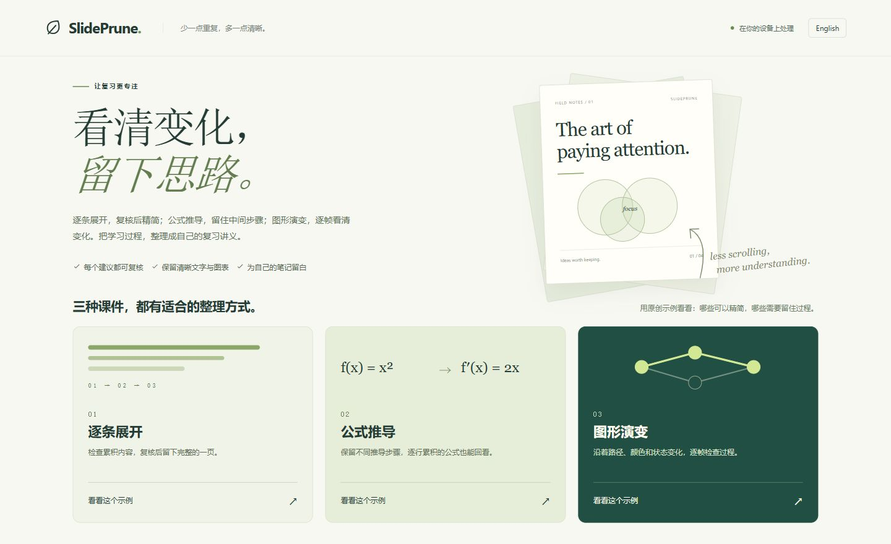
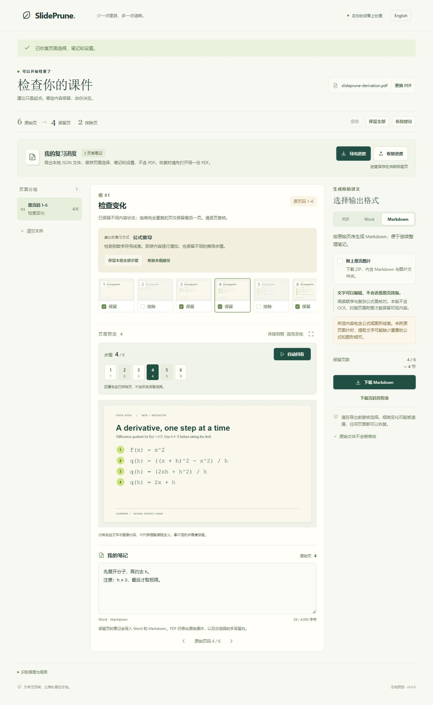

# SlidePrune

复核逐条展开、公式推导和图形演变的 PDF 课件，再整理成方便复习和打印的讲义。文件在浏览器本地处理。

[English](README.md)

有些课件会把每次出现的新要点、每一步公式或动画都导出成一页 PDF。SlidePrune 比较相邻页面，提出可精简的重复内容，并帮助你检查需要保留的过程，再逐页复核后导出。

复核后的页面可导出为 PDF、Word（`.docx`）或 Markdown，输入仍只支持 PDF。

**当前版本：0.4.0 本地预览。** 逐页笔记和进度保存/恢复为尚未发布的本地新增功能，当前目录没有公开演示站地址。



原来的自制演示课件从 12 页整理为 8 个保留页，仅用于展示流程，不代表一般识别准确率。[较早的复核界面](docs/assets/review.jpg)与[实际输出预览](docs/assets/export-preview.jpg)展示原有 PDF 讲义流程。

试读[演示原始 PDF](docs/assets/demo-lecture.pdf)与[导出的笔记讲义](docs/assets/demo-study-notes.pdf)。

新增格式可试读 [Word 图文版](docs/assets/demo-study-notes.docx)、[Markdown 文字版](docs/assets/demo-study-notes.md)和[Markdown 附图 ZIP](docs/assets/demo-markdown.zip)。[查看导出面板](docs/assets/document-export.png)。

## 三种课件，分别复核

| 场景 | 整理方式 |
| --- | --- |
| 逐条展开 | 仅在前面的文字和渲染前景看起来仍然保留时，建议留下后面的完整页；接受建议前检查展开过程。 |
| 公式推导 | 提取文字中的数学符号是保留步骤的线索。同一连续分组内，即使公式逐行累积，也保留不同步骤；相邻的精确副本仍可精简。 |
| 图形演变 | 按原页顺序检查路径、颜色和状态变化。画面变化而提取文字一致时，可提示使用图形复核方式。 |

首页可分别打开三个原创示例。公式示例从 `f(x) = x^2` 推导出导数 `2x`；图形示例展示信号沿两条图路径传播。两份新示例都包含五个不同状态和最后状态的一份精确副本：**6 个原页 → 保留 5 页**，保留原始页码 **1、2、3、4、6**。这些数字只描述演示样本，不代表一般识别效果。

有多页的分组可以点击“**自动回看**”，按顺序播放组内所有原页，包含已排除页，到最后一步停止。回看不会改变导出选择。也可以点击步骤按钮逐帧检查，或使用“**保留本组全部步骤**”“**恢复本组建议**”只修改当前分组；选页操作支持撤销。

场景分类来自文字与图像比较，不代表理解课程含义。漏掉数学线索或拿不准的分组仍需人工复核；程序不做 OCR，也不推理公式。

## 本地运行

### Windows 便携 ZIP

项目作者可以在本地生成便携 ZIP 供试用，**当前尚未公开发布**。拿到本地生成的包后，解压并双击 `SlidePrune.exe` 即可。需要 **.NET Framework 4.x** 和较新的桌面浏览器，不需要安装 Node.js。启动器在本地提供应用页面，并会尝试打开默认浏览器；自动打开浏览器的行为尚未实测。

请完整保留压缩包内的文件：除程序外，还包含第三方许可证声明和原始 Liberation 1.07.4 字体源码包。启动说明见包内 `START-HERE.txt`。

### 从源码运行

需要 **Node.js 22.13 或以上版本**和 npm。在项目目录运行：

```sh
npm install
npm run dev
```

打开 Vite 输出的本地地址。可以先体验三种场景的内置示例，也可以选择自己的 PDF。每份文件上限为 **40 MiB、250 页**。不需要账号、API Key 或处理文件的后端服务。

```sh
npm test
npm run build
npm run preview
```

`build` 检查 TypeScript 并在 `dist/` 中生成静态应用；`preview` 在本地预览构建结果。首次安装依赖需要联网；应用使用的 worker 和字体资源从本地加载。

## 先复核，再导出

1. 导入 PDF，或打开逐条展开、公式推导、图形演变的原创示例。
2. 查看分组建议与缩略图。自动回看原页序列，或跳到某一步检查。可将当前页与同组前一页并排对照，或高亮两页的视觉差异。打开原页放大预览可检查细节，也可直接在预览中保留或排除该页。
3. 为每一页选择保留或排除。不确定时可以保留本组全部步骤，也可以保留整份文档的所有页；本组建议可单独恢复。点击“撤销”或按 **Ctrl/Cmd+Z** 可撤销选择操作。
4. 在任意原页的“**我的笔记**”中写下要点或疑问。离开前点击“**导出进度**”，下载保存选页、笔记和设置。
5. 选择 **PDF、Word 或 Markdown**。PDF 可选择排版并点击“预览讲义”检查任意一张；Word 与 Markdown 可选择是否附上原页图片。
6. 下载所选格式并检查保存的文件。另有记录选择依据的 JSON 页码对照表；恢复工作请使用进度文件。

| PDF 排版 | 导出结果 |
| --- | --- |
| 原始课件 / Slides | 按原顺序保留选中的原尺寸页面 |
| 笔记讲义 / Notes | 每张 A4 纸放两页课件，并留出手写笔记空间 |
| 四页拼版 / Grid | 每张 A4 纸放四页课件 |

**Word** 将提取文字保存为可编辑的 `.docx`，默认附上原页 PNG 供对照。**Markdown** 可导出纯文本 `.md`，或包含 `index.md` 与 `images/` 文件夹的 ZIP。新载入的文件包含公式或图形线索时，Markdown 默认开启附图；关闭后会提示可能缺少视觉细节。打开或导入时，请让图片文件夹与 `index.md` 保持相邻。

所有 PDF 排版、Word 和 Markdown 共用复核后的同一组选页，按原始顺序导出。播放步骤或切换查看方式不会自动增减导出页面。

### 逐页笔记与进度保存



查看原页时可以直接写笔记。**Word 和 Markdown 只导出保留页的笔记**，放在对应页提取文字后的“我的笔记”下，保留纯文本和换行；**PDF 不包含输入的笔记**。已排除页的笔记仍保留在进度文件中，重新保留该页后也会写入 Word/Markdown。

“**导出进度**”会主动下载本地 JSON 文件，记录 PDF 标识、保留页、当前页、全部逐页笔记和导出设置，**不包含 PDF 原文件或页面图片**。应用**不会自动保存**；刷新或关闭标签页后，尚未导出的修改会丢失。请确认浏览器已保存下载文件。

继续复习时，先打开**完全相同的原始 PDF**，再点击“**恢复进度**”选择已保存的 JSON。应用先核对 SHA-256、文件字节数和页数；当前有尚未导出的修改时，会先提示确认再替换。只改文件名、不改文件内容可以恢复；修改或重新导出过的 PDF 不匹配。请将原始 PDF 与进度文件一起保管；浏览器指纹校验需要 HTTPS 或 localhost 环境。

笔记上限为**每页 4,000 个 UTF-16 代码单元、合计 200,000 个**，部分表情会计作两个；进度文件上限为 **2 MiB**。进度文件包含你写的笔记，分享时也会分享这些内容。

Word 与 Markdown 按原始页码分节，不还原课件排版，也不做 OCR。提取后的阅读顺序和公式需要校对；图片只是参考，不等于可编辑公式。没有可提取文字的页面需要附图才能保留可视内容。附图保持原页比例，最高 **1280 × 1800 像素**，每次导出的 **PNG 图片数据合计上限为 80 MiB**；超过限制时，请减少页数或关闭附图。

放大预览会按需从 PDF 重新渲染当前页，保持原比例，最高 **2200 × 3200 像素**。点击“放大细节”后可滚动检查。原页和 PDF 输出预览都支持 **← / →** 翻页、**Escape** 关闭，也可输入页码直接跳转。每张输出预览会标注对应的原始页码。

**输出预览仅支持 PDF**，由按钮主动触发。文件、布局和选页未改变时，预览与下载复用同一份已生成的 PDF；Word 和 Markdown 请下载后检查。应用可以发起浏览器下载，但无法确认浏览器已保存文件；请检查下载列表和保存后的完整文件。

界面支持简体中文和英文。决策报告记录原始页码与选择依据，便于核对导出内容。

## 算法能做什么

导入 PDF 后，相邻页的判断会用提取文本和最高 **800 像素宽、1600 像素高**的完整页面渲染结果核验；另保留最高 480 像素宽的采样图，用于减少存储占用和高亮变化。对完全重复或通过核验的累积展开页提出排除建议；检测到提取文字中的数学符号时，同一连续分组内不同的累积步骤也会保留。出现替换、消失或不确定的内容时，保留页面供人工复核。当前不会在整份文档中寻找相隔很远的重复页。

**这些是启发式建议，不能保证不误删内容。** 检测仍有渲染分辨率限制，很小的公式变化、低对比度图形、特殊字体和复杂动画都可能影响判断。最后一帧也不一定包含前面出现过的所有内容。请用原页高清预览检查拟排除的页面，并在使用前复核导出结果。

[abnTeX2 文字展开模板](https://ctan.org/pkg/abntex2)在 Node 的真实 PDF.js 渲染和 Windows 便携版页面的实际浏览器验证中，均得到 **13 页保留 11 页**：排除第 4、5 页，保留第 6 页的完整文字展开结果。浏览器实测 Beamer 官方会议示例时，**31 页仍保留 31 页**：第 7–8 页的文字变化得到了保留，但这个模板**没有获得自动减页收益**。这两份样本不能代表一般识别准确率，详见[验证记录](docs/verification.md)。

原文件不会被覆盖。**PDF 导出**复制或嵌入原始 PDF 页面内容，不用预览缩略图替代原页；原本为矢量的公式和图形仍以矢量保留，扫描图仍是位图。重新组装 PDF 后，交互式批注、链接、书签等文档特性不保证保留。Word 和 Markdown 则使用上述提取文字及可选的位图参考。

## 隐私与使用范围

- 解析、比较和导出均在浏览器中完成，没有文件上传接口、遥测或外部 AI 服务。
- 文件数据仅保留在当前会话内存中，不写入浏览器持久存储。清除文件或关闭页面后会话结束；已下载文件仍保存在你选择的位置。
- 仅接受 PDF。加密或损坏的文件会被拒绝。当前不支持 PPTX、OCR、内容总结、批量文件夹和 PDF 编辑。
- 带可选内容图层（OCG / `OCProperties`）的 PDF 仍可查看，但本版会拒绝生成导出预览及导出文件，避免隐藏图层在输出中意外显示。
- 文件上限用于约束常见任务，但复杂 PDF 仍可能占用较多内存。建议在较新的桌面浏览器中使用。
- PDF 输出预览目前也受同一读取器的 40 MiB 上限约束。若导出的 PDF 膨胀并超过此限制，仍可生成文件，但无法在应用内预览；请用 PDF 阅读器检查保存的文件。
- 请处理自己有权使用的材料。内置演示由项目生成，不含他人的课程课件。

## 开发与反馈

`src/pdf.ts` 负责加载和渲染，`src/analyze.ts` 负责比较与建议，`src/export.ts` 负责 PDF 导出，`src/document-export.ts` 负责 Word 与 Markdown 导出。`src/demo.ts` 保留原始综合演示，`src/study-demo.ts` 提供公式和图形课件；`src/study-ui.ts` 与 `src/study.css` 提供场景入口、复核提示和步骤控件，`src/sequence-player.ts` 负责可停止的单次回看。其余界面与语言支持位于 `src/main.ts`、`src/i18n.ts` 和 `src/styles.css`。

`src/review-project.ts` 校验本地进度文件与 PDF 标识，`src/review-ui.ts` 和 `src/review.css` 提供逐页笔记与进度操作界面。

维护者可按[部署说明](docs/deployment.md)准备浏览器演示站。网页打包会附上第三方声明和对应字体源码；仅推送源码不会自动上线网站。

检查打包输入并生成 Windows 便携 ZIP：

```sh
npm run test:package
npm run package:windows
```

打包需在 Windows 上运行，使用已安装的 .NET Framework C# 编译器，命令会输出生成包的位置。包内附带第三方声明和已核验的 Liberation 字体源码包；本地没有缓存时，打包过程会下载该源码包。命令只生成本地产物，不会发布。

反馈问题时请说明浏览器、复现步骤、原始页码，以及问题发生在识别建议还是导出环节。优先使用精简的自制样本，不要未经许可公开私人或受版权保护的课件。

运行检查与问题反馈信息见[贡献说明](CONTRIBUTING.md)，支持中文和英文反馈。

阅读[方向调研](docs/research.md)与[验证记录](docs/verification.md)，了解现有替代工具、实测结果及当前限制。

## 许可证

[MIT](LICENSE)，Copyright 2026 SlidePrune contributors。第三方依赖各自遵循其原有许可证。
